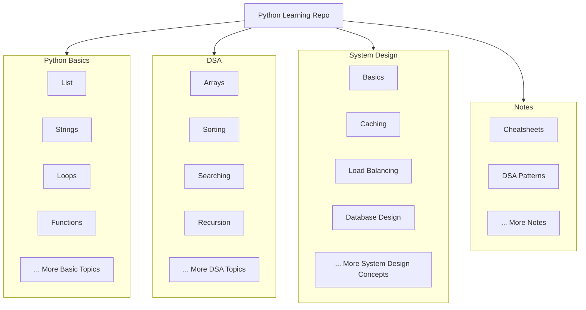

```mermaid

graph TB
    A[Python Learning Repo]

    subgraph B [Python Basics]
        B1[List]
        B2[Strings]
        B3[Loops]
        B4[Functions]
        B5[... More Basic Topics]
    end

    subgraph C [DSA]
        C1[Arrays]
        C2[Sorting]
        C3[Searching]
        C4[Recursion]
        C5[... More DSA Topics]
    end

    subgraph D [System Design]
        D1[Basics]
        D2[Caching]
        D3[Load Balancing]
        D4[Database Design]
        D5[... More System Design Concepts]
    end

    subgraph E [Notes]
        E1[Cheatsheets]
        E2[DSA Patterns]
        E3[... More Notes]
    end

    A --> B
    A --> C
    A --> D
    A --> E

```